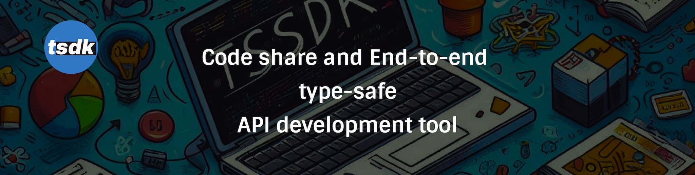

<p align="center">
  <a href="https://tsdk.dev">
      
  </a>
</p>

<div align="center">
  <p>Type-safe API development and code share tool for TypeScript projects.</p>
</div>


[](https://www.npmjs.com/package/tsdk)
[](https://packagephobia.com/result?p=tsdk)


## Getting Started

Visit <a aria-label="tsdk intro" href="https://tsdk.dev/docs/intro">https://tsdk.dev/docs/intro</a> to get started with tsdk.

## Website

https://tsdk.dev or [中文](https://tsdk.dev/zh-CN)

## Documentation

https://tsdk.dev/docs/intro

## Development

This repository uses [PNPM Workspaces](https://pnpm.io/workspaces)

Install dependencies:

```sh
pnpm install
```

### Structure

- [`packages/tsdk`](./packages/tsdk) - `tsdk` package.
- [`packages/tsdk-server-adapters`](./packages/tsdk-server-adapters) - Server adapters package for tsdk.
- [`packages/bench`](./packages/bench) - benchmark for `tsdk-server-adapters`.
- [`configs/*`](./packages/bench) - config packages for ts/eslint/test etc.
- [`examples/*`](./examples) - Examples that only use packages and aren't aware of other apps.

## Community

Welcome to join the [Discussions](https://github.com/tsdk-monorepo/tsdk/discussions)
