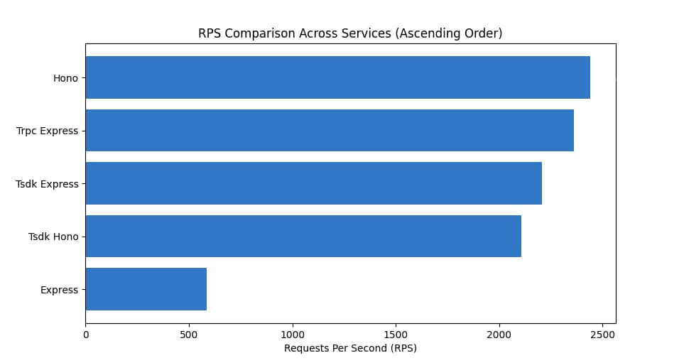
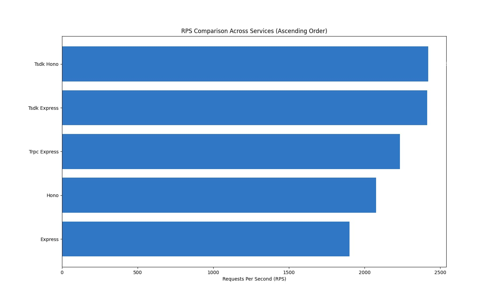

# Performance benchmark

We create 2,000 APIs，benchmark these framework: express，hono，tsdk-express-adapter，tsdk-hono-adapter and trpc's express adapter.

### Environments

- Bench tool plow： https://github.com/six-ddc/plow

- Network: family LAN

- Server Hardware: OrangePI 5 Plus

- Running Hardware: Macbook M1 Pro

### Single core result

> RPS = Requests Per Second, Higer better

| Service              | RPS      | Elapsed | Count | 2xx   | Reads     | Writes    |
| -------------------- | -------- | ------- | ----- | ----- | --------- | --------- |
| Hono                 | 2440.637 | 30s     | 73228 | 73228 | 0.508MB/s | 0.186MB/s |
| Trpc Express Adapter | 2360.502 | 30s     | 70817 | 70817 | 0.554MB/s | 0.180MB/s |
| tsdk Express Adapter | 2207.844 | 30s     | 66240 | 66240 | 0.596MB/s | 0.169MB/s |
| tsdk Hono Adapter    | 2106.088 | 30s     | 63188 | 63188 | 0.438MB/s | 0.161MB/s |
| Express              | 584.828  | 30s     | 17547 | 17547 | 0.158MB/s | 0.045MB/s |

### Multiple cores result (8 cores)

> Run with command `pm2 start app.js -i max`

| Service      | RPS      | Elapsed | Count | 2xx   | Reads     | Writes    |
| ------------ | -------- | ------- | ----- | ----- | --------- | --------- |
| tsdk Hono    | 2420.152 | 30s     | 72609 | 72609 | 0.504MB/s | 0.185MB/s |
| tsdk Express | 2413.334 | 30s     | 72403 | 72403 | 0.652MB/s | 0.184MB/s |
| Trpc Express | 2233.697 | 30s     | 67011 | 67011 | 0.525MB/s | 0.171MB/s |
| Hono         | 2077.162 | 30s     | 62317 | 62317 | 0.432MB/s | 0.159MB/s |
| Express      | 1901.312 | 30s     | 57049 | 57049 | 0.514MB/s | 0.145MB/s |

### Benchmark code

https://github.com/tsdk-monorepo/tsdk/tree/main/packages/bench
